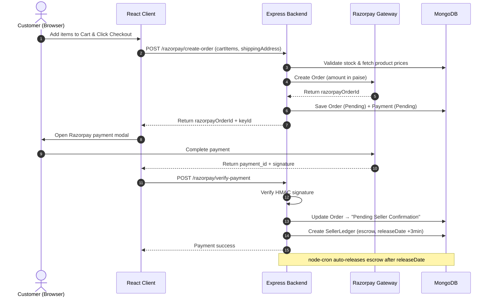

# 🐾 PawMart — Pet & Animal E-Commerce Platform

A full-stack MERN e-commerce marketplace with integrated payment processing, multi-vendor escrow split payouts, and a third-party logistics aggregator sandbox.

---

## 🚀 Tech Stack

| Layer | Technology |
|---|---|
| **Frontend** | React 19, React Router v7, Vite 8 |
| **Backend** | Node.js, Express 5 |
| **Database** | MongoDB (Mongoose 9) |
| **Payments** | Razorpay (active) · Stripe (sandbox, commented out) |
| **Styling** | Vanilla CSS (light theme, no frameworks) |
| **Auth** | JWT (Bearer tokens via `Authorization` header) |
| **Background Jobs** | node-cron (escrow auto-release every 30s) |

---

## 🖥️ Local URLs

| Portal | URL |
|---|---|
| **Storefront (Customer)** | http://localhost:5174 |
| **Backend API** | http://localhost:3000 |
| **Seller Dashboard** | http://localhost:5174/seller/login |
| **Shipping Dashboard** | http://localhost:5174/shipping/login |

---

## 🔐 Login Credentials

### 🛒 Customer (No Login Required)
Customers browse products and checkout without an account. Order history is tracked by session.

---

### 🏪 Seller Dashboard — `/seller/login`

> **Note:** Products are alternately assigned to sellers during seeding (index 0, 2, 4... → Acme Electronics | index 1, 3, 5... → Restricted Goods Corp).

| Field | Seller 1 | Seller 2 |
|---|---|---|
| **Name** | Acme Electronics | Restricted Goods Corp |
| **Email** | `acme.payouts@example.com` | `restricted.corp@example.com` |
| **Password** | `seller123` | `seller123` |
| **Account Status** | ✅ Active | ⚠️ Restricted |
| **Bank** | Chase Bank (`Chase-123456789`) | Wells Fargo (`WF-987654321`) |

> **Tip:** To see orders in the Seller Dashboard, log in as the seller whose products were purchased.
> Product #1 → Acme Electronics, Product #2 → Restricted Goods Corp, and so on alternately.

---

### 🚚 Shipping Dashboard — `/shipping/login`

| Field | Value |
|---|---|
| **Partner Name** | Global Express Logistics |
| **Email** | `shipping@partner.com` |
| **Password** | `shipping123` |

---

## ⚙️ Getting Started

### 1. Install Dependencies

```bash
# Install server dependencies
cd server
npm install

# Install client dependencies
cd ../client
npm install
```

### 2. Configure Environment

The server `.env` is pre-configured for local MongoDB. Razorpay keys are included:

```env
PORT=3000
MONGO_URI=your_mongodb_connection_string
RAZORPAY_KEY_ID=your_razorpay_key_id
RAZORPAY_KEY_SECRET=your_razorpay_key_secret
```

> MongoDB Atlas is also supported — replace `<db_password>` in the MONGO_URI to use cloud.

### 3. Seed the Database

```bash
cd server
npm run seed
```

This seeds:
- **1 Shipping Partner** — Global Express Logistics
- **2 Sellers** — Acme Electronics (Active) & Restricted Goods Corp (Restricted)
- **30 Products** — fetched live from `https://dummyjson.com/products` and split across sellers

### 4. Start the Servers

```bash
# Terminal 1 — Backend
cd server
npm start        # runs on http://localhost:3000

# Terminal 2 — Frontend
cd client
npm run dev      # runs on http://localhost:5174
```

---

## 🗺️ Page Routes

| Route | Description |
|---|---|
| `/` | Home page with featured products |
| `/products` | Full product catalog |
| `/products/:id` | Product detail page |
| `/cart` | Shopping cart |
| `/checkout` | Razorpay checkout + payment |
| `/my-orders` | Customer order history |
| `/order/:id` | Customer order detail |
| `/seller/login` | Seller login page |
| `/seller/dashboard` | Seller merchant portal |
| `/seller/order/:id` | Seller order detail — Accept or Reject |
| `/shipping/login` | Shipping partner login |
| `/shipping/dashboard` | Logistics portal |
| `/shipping/order/:id` | Shipment detail — Update status |

---

## 📦 Order Flow

```
Customer Checkout
      │
      ▼
POST /razorpay/create-order
  → Validates cart, stock, calculates total (in paise)
  → Creates Razorpay order
  → Saves Order (Pending) + Payment (Pending) in MongoDB
      │
      ▼
Razorpay Payment Modal (client-side)
  → Customer completes UPI / card / netbanking payment
      │
      ▼
POST /razorpay/verify-payment
  → Verifies HMAC signature
  → Order status → "Pending Seller Confirmation"
  → Payment status → "Paid"
  → Escrow (SellerLedger) created with releaseDate
      │
      ▼
Seller Dashboard → Accept Order
  → Order status → "Confirmed" → "Preparing Shipment"
  → Shipment booked → AWB + Tracking # generated
      │
      ▼
Shipping Dashboard → Update Status
  → PICKED_UP / IN_TRANSIT → Shipped
  → OUT_FOR_DELIVERY → Out for Delivery
  → DELIVERED → Completed (Escrow auto-released by cron)
```

---

## 🧭 Order Status State Machine

```
Pending Seller Confirmation
    ├── (Seller Accepts) → Confirmed → Preparing Shipment → Shipped → Out for Delivery → Completed
    └── (Seller Rejects) → Rejected  (Refund initiated)
```

### Shipment Status Values

| Value | Meaning |
|---|---|
| `BOOKED` | Shipment created, awaiting carrier pickup |
| `PICKED_UP` | Carrier collected the parcel |
| `IN_TRANSIT` | Parcel in transit to destination |
| `OUT_FOR_DELIVERY` | Last-mile delivery in progress |
| `DELIVERED` | Successfully delivered to customer |
| `FAILED` | Delivery attempt failed |

---

## 📊 Database Models

```
  ┌──────────────┐
  │    Seller    │◄────────────────────────────┐
  └──────┬───────┘                             │
         │ (1)                                 │ (1)
         ▼ (N)                                 │
  ┌──────────────┐              ┌──────────────┴┐
  │   Product    │◄─────────────│     Order     │◄────────┐
  └──────────────┘              └──────┬────────┘         │
                                       │                  │
              ┌────────────────────────┼──────────────────┤
              ▼                        ▼                  ▼
       ┌──────────────┐         ┌─────────────┐   ┌──────────────┐
       │   Payment    │         │SellerLedger │   │   Shipment   │
       └──────────────┘         └─────────────┘   └──────────────┘
```

---

## 💰 Split Payout Formula

```
Net Payout = Gross Sales
           − Platform Commission (12%)
           − Payment Gateway Fees (₹0.30)
           − Logistics Fee
           − Taxes
           − Reserve
```

Escrow is held in `SellerLedger` and auto-released via a **node-cron job every 30 seconds** once `releaseDate` is past.

---

## 🔌 Key API Endpoints

### Customer / Payment

| Method | Endpoint | Description |
|---|---|---|
| `GET` | `/api/v1/payments/products` | List all products |
| `GET` | `/api/v1/payments/orders` | List all orders |
| `GET` | `/api/v1/payments/orders/:id` | Get order by ID |
| `POST` | `/api/v1/payments/razorpay/create-order` | Create Razorpay order |
| `POST` | `/api/v1/payments/razorpay/verify-payment` | Verify HMAC payment signature |

### Seller Dashboard

| Method | Endpoint | Auth | Description |
|---|---|---|---|
| `POST` | `/api/v1/payments/seller/login` | — | Seller login, returns JWT |
| `GET` | `/api/v1/payments/seller/orders` | 🔒 Bearer | Get seller's orders (filtered by sellerId) |
| `POST` | `/api/v1/payments/seller/orders/:id/accept` | 🔒 Bearer | Accept order + book shipment |
| `POST` | `/api/v1/payments/seller/orders/:id/reject` | 🔒 Bearer | Reject order + initiate refund |
| `GET` | `/api/v1/payments/sellers/:id/dashboard` | — | Seller earnings + ledger + payout logs |

### Shipping / Logistics

| Method | Endpoint | Auth | Description |
|---|---|---|---|
| `POST` | `/api/v1/logistics/shipping/login` | — | Shipping partner login, returns JWT |
| `GET` | `/api/v1/logistics/shipping/all-orders` | 🔒 Bearer | All paid orders (full pipeline view) |
| `GET` | `/api/v1/logistics/shipping/orders` | 🔒 Bearer | Active shipment records only |
| `GET` | `/api/v1/logistics/shipping/orders/:id` | 🔒 Bearer | Single shipment detail |
| `POST` | `/api/v1/logistics/shipping/orders/:id/status` | 🔒 Bearer | Update shipment status |
| `POST` | `/api/v1/logistics/shipping-rates` | — | Calculate dynamic shipping rates |
| `POST` | `/api/v1/logistics/tracking-update` | — | Carrier webhook — update tracking status |

---

## 🚚 Logistics Sandbox Examples

### Calculate Shipping Rates

**POST** `/api/v1/logistics/shipping-rates`

```json
{
  "originZipCode": "90210",
  "destinationZipCode": "10001",
  "parcelWeight": 2.5,
  "parcelLength": 12,
  "parcelWidth": 10,
  "parcelHeight": 8
}
```

**Response:**
```json
{
  "success": true,
  "rates": [
    { "carrierName": "FedEx Ground Sandbox", "serviceName": "Standard Shipping", "rate": 5675, "etaDays": 5 },
    { "carrierName": "DHL Express Sandbox", "serviceName": "Express Saver", "rate": 9075, "etaDays": 2 }
  ]
}
```

### Tracking Webhook Simulation

**POST** `/api/v1/logistics/tracking-update`

```json
{
  "trackingNumber": "TRK_FEDEX_5CC605E26CF8",
  "carrierStatus": "DELIVERED"
}
```

### Carrier Status → Order Status Mapping

| Carrier Status | Order Status | Shipping Status | Shipment Status |
|---|---|---|---|
| `PICKED_UP` / `IN_TRANSIT` | `Shipped` | `Shipped` | `IN_TRANSIT` |
| `OUT_FOR_DELIVERY` | `Out for Delivery` | `Out for Delivery` | `OUT_FOR_DELIVERY` |
| `DELIVERED` | `Completed` | `Delivered` | `DELIVERED` |

---

## 📝 Sequence Diagram



---

## 🛡️ Authentication Details

JWT tokens are issued on login and must be sent as:

```
Authorization: Bearer <token>
```

Tokens are stored in `localStorage`:
- **Seller:** `sellerToken` (JWT) + `seller` (JSON seller object)
- **Shipping:** `shippingToken` (JWT) + `shippingPartner` (JSON partner object)

---

## 📁 Project Structure

```
e-commerce/
├── client/                         # React + Vite frontend
│   └── src/
│       ├── pages/
│       │   ├── Home.jsx
│       │   ├── Products.jsx
│       │   ├── ProductDetails.jsx
│       │   ├── Cart.jsx
│       │   ├── Checkout.jsx            # Razorpay payment flow
│       │   ├── MyOrders.jsx
│       │   ├── CustomerOrderDetail.jsx
│       │   ├── SellerLogin.jsx
│       │   ├── SellerDashboard.jsx     # Merchant portal (orders + earnings)
│       │   ├── SellerOrderDetail.jsx
│       │   ├── ShippingLogin.jsx
│       │   ├── ShippingDashboard.jsx   # Logistics portal (orders + shipments)
│       │   └── ShippingOrderDetail.jsx
│       ├── components/
│       │   └── Navbar.jsx
│       └── context/
│           └── CartContext.jsx
│
└── server/                         # Express backend
    ├── controllers/
    │   └── paymentController.js        # Core business logic
    ├── models/
    │   ├── Order.js
    │   ├── Payment.js
    │   ├── Product.js
    │   ├── Seller.js
    │   ├── SellerLedger.js
    │   ├── PayoutLog.js
    │   ├── Shipment.js
    │   └── ShippingPartner.js
    ├── routes/
    │   ├── paymentRoutes.js
    │   └── logisticsRoutes.js
    ├── services/
    │   ├── logisticsService.js         # Shipment booking & AWB generation
    │   └── payoutService.js            # Escrow split calculation
    ├── middleware/
    │   └── authMiddleware.js           # JWT protection for seller & shipping
    ├── utils/
    │   └── seedProducts.js             # Database seeder
    └── server.js
```


## Project Notes

This project has been developed primarily to demonstrate the implementation of secure payment processing, multi-vendor payout workflows, escrow handling, logistics integration, and end-to-end order lifecycle management. Therefore, the Product APIs currently use dummy/mock data, as the primary focus of the assignment is on Payment Gateway Integration, Seller Payout Processing, Logistics & Shipping Partner Integration, and synchronization of orders and tracking across multiple dashboards rather than building a production-ready product catalog.

To simplify evaluation and testing, predefined accounts have been seeded into the database.

### Seller Dashboard Accounts

| Merchant Name         | Email Address                                                     | Password  | Account Status |
| --------------------- | ----------------------------------------------------------------- | --------- | -------------- |
| Acme Electronics      | [acme.payouts@example.com](mailto:acme.payouts@example.com)       | seller123 | Active         |
| Restricted Goods Corp | [restricted.corp@example.com](mailto:restricted.corp@example.com) | seller123 | Restricted     |

### Shipping Dashboard Account

| Shipping Carrier Name    | Email Address                                       | Password    | Account Status |
| ------------------------ | --------------------------------------------------- | ----------- | -------------- |
| Global Express Logistics | [shipping@partner.com](mailto:shipping@partner.com) | shipping123 | Active         |

### Why is "Restricted Goods Corp" marked as Restricted?

The **Restricted** status has been intentionally seeded to demonstrate and validate the multi-vendor escrow payout security checks required by the assignment.

In a real marketplace, a seller may be restricted due to policy violations, fraudulent activities, compliance issues, or prohibited products. In such situations, seller payouts must be frozen immediately to protect customers and platform finances.

This project simulates that behaviour as follows:

1. A customer successfully places an order from **Restricted Goods Corp**.
2. The payment is processed successfully and an escrow entry is created.
3. The background payout worker periodically evaluates merchant eligibility before releasing funds.
4. The payout logic behaves as follows:

   * **Acme Electronics (Active):** The escrow period matures and funds are released to the seller's available balance.
   * **Restricted Goods Corp (Restricted):** The payout worker aborts the release and keeps the funds on hold, ensuring that no disbursement is made to restricted accounts.

This implementation allows evaluators to verify that the escrow mechanism, payout scheduling, and financial fail-safe checks are functioning correctly and that restricted merchants cannot receive payouts even after successful customer payments.

The predefined accounts are provided solely for demonstration purposes and allow evaluators to directly test seller order management, payout processing, shipment handling, tracking updates, and dashboard synchronization without additional setup or configuration.
